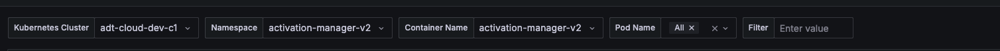

# Hướng dẫn check log service trên K8s

# Link dashboard check log

Cần tài khoản để đăng nhập, order Sysadmin tạo nếu chưa có.

## Adtech

<https://metrics.admicro.vn/d/fe2fcy28zjh1cb/kubernetes-logs>

## Bizfly

<https://metrics.zamba.vn/d/fe2fcy28zjh1cb/kubernetes-logs>

# Cách sử dụng

 

* Chọn **Kubernetes Cluster, Namespace** và **Contain Name hoặc Pod Name** theo nhu cầu.
* **Filter:** Có thể nhập theo keyword muốn tìm hoặc sử dụng kết hợp 1 số chức năng khác, tham khảo [LogsQL](https://docs.victoriametrics.com/victorialogs/logsql/).
* Chọn thời gian muốn lấy log: ví dụ **Last 1 hour**, **Last 3 hours**, hoặc 1 khoảng thời gian cụ thể nào đó.

:::tip
**Kiên nhẫn chờ đợi nếu tool query hơi lâu!** :sweat_smile:

:::