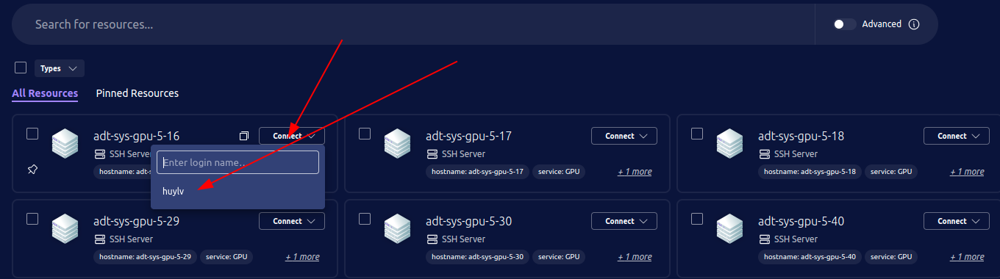
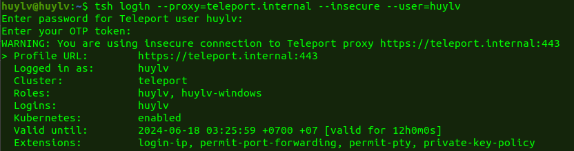
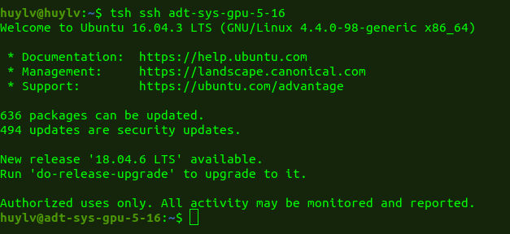
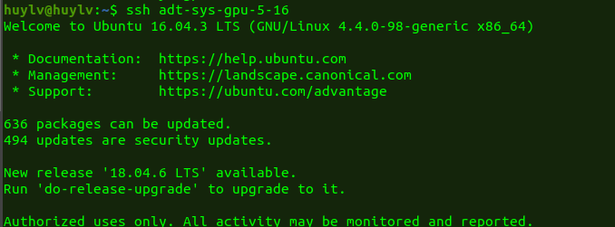

# Hướng dẫn sử dụng Teleport thay thế ssh

## Thông tin về Teleport

* Teleport là một giải pháp quản lý truy cập và bảo mật mã nguồn mở được thiết kế để giúp các tổ chức quản lý và bảo vệ truy cập vào các cơ sở hạ tầng công nghệ thông tin của họ, bao gồm SSH, Kubernetes, cơ sở dữ liệu, và các ứng dụng web. Teleport cung cấp một hệ thống quản lý truy cập an toàn, ghi lại các phiên làm việc, và đơn giản hóa quy trình xác thực và ủy quyền.
* **Quản lý truy cập**:
  * Hỗ trợ xác thực dựa trên chứng chỉ ngắn hạn thay vì các khóa SSH tĩnh.
  * Cung cấp xác thực hai yếu tố (2FA) để tăng cường bảo mật.
* **Ghi lại phiên làm việc**:
  * Ghi lại và phát lại các phiên SSH và các phiên làm việc khác.
  * Cung cấp khả năng theo dõi và kiểm tra các hoạt động của người dùng.
* Tài liệu về Teleport tham khảo: <https://goteleport.com/docs/>

  \

## Hướng dẫn sử dụng teleport

* Gửi issue xin quyền vào server như bình thường. lần đầu tiên vào Sysadmin gửi link tạo Pass và OTP (Password tối thiểu 12 ký tự. bao gồm chữ hoa, chữ thường, chữ số và ký tự đặc biệt). 
* Có 3 cách để truy cập server
  * Cách 1:
    * Vào web <https://gw.vcadm.vn/> login bằng user, password và OTP
    * tại màn hình chính tìm tên server (server được đặt theo hostname) hoặc dùng thanh Search để tìm theo hostname
    * Click vào Connect và vào user cần connect đến server, trình duyệt sẽ mở ra 1 tab mới
    * 

    \
  * Cách 2:
    * Sử dụng công cụ tsh: cài đặt teleport lên local: 
    * Xem dowload tool ở đây <https://goteleport.com/download/>
      * Linux: `curl https://goteleport.com/static/install.sh | bash -s 18.0.2`
      * MacOS: https://cdn.teleport.dev/teleport-18.0.2.pkg
      * Window: https://cdn.teleport.dev/teleport-v18.0.2-windows-amd64-bin.zip (giải nén file zip)
    * Cách dùng: 
      * Mở teminal và login vào Proxy như sau:
      * `tsh login --proxy=gw.vcadm.vn --user=<username>`
      * Nhập password
      * Nhập OTP
      * 
      * List các server được quyền truy cập vào `tsh ls`
      * Để vào server nào thì dùng command `tsh ssh <node name>`hoặc `tsh ssh <user>@<node name>` 
      * User có thể dùng IP để connect thêm từ khóa ip=<IP_addr> như sau `tsh ssh <user>@ip=<IP_addr>`
      * 
      * Dùng command ssh thay cho tsh ssh
      * `tsh config >> ~/.ssh/config` 
      * Edit file  \~/.ssh/config dòng `Host *.teleport !teleport.internal` *(ở trên dòng Port 3022) sửa thành*  `Host adt-* lotus-*`
      * xong dùng ssh <node name>
      * 
    * Dùng tsh scp để copy 1 file từ local lên server và ngược lại
    * tsh scp <file nguồn> <user>@<node name>:<folder đích>
    * `tsh scp test.txt adt-sys-gpu-5-16:/home/huylv`

      \
  * Cách 3: Dùng teleport connect
    * Dowload và cài đặt 
    * Linux: curl https://goteleport.com/static/install-connect.sh | bash -s 18.0.2
    * MacOS: https://cdn.teleport.dev/Teleport%20Connect-18.0.2.dmg
    * Windows: https://cdn.teleport.dev/Teleport%20Connect%20Setup-18.0.2.exe
    * chạy command `teleport-connect`
    * và làm theo các bước tiếp theo

    \