# Hướng dẫn sử dụng VPN

## **I. Nhận thông tin tài khoản.**


* Khi tạo xong VPN system admin có gửi mail về có tiêu đề

  ```javascript
  V/v Bàn giao tài khoản VPN
  ```
* Phần nội dung của mail có 1 đường link thông tin tài khoản VPN có dạng

  \
  * Link: [https://vpn.vccloud.vn](https://vpn.vccloud.vn/)

    \
  * User: [username@admicro.vn](mailto:username@admicro.vn)

    \
  * Pass: xxx 

    \
  * Download file cài đặt và file config: <https://vpn.vccloud.vn/user-site/down> 

    \
  * Hướng dẫn sử dụng: <https://vpn.vccloud.vn/user-site/doc> OTP sẽ được gửi về số điện thoại bạn đã đăng ký.

    \
  * Lấy mã OTP từ Google Authenticator

    \
  * Tải Google Authenticator trên các điện thoại Android và IOS 
    * Link Android: <https://play.google.com/store/apps/details?id=com.google.android.apps.authenticator2&hl=vi&gl=US> 
    * Link iOS( iPhone ): <https://apps.apple.com/vn/app/google-authenticator/id388497605> 
    * Hoặc truy cập vào kho ứng dụng CHPlay (Android) hoặc AppStore (iOS) tìm kiếm từ khóa `Google Authenticator` và cài đặt

      \
  * Mở app lên và thêm Secret key được nhận qua tin nhắn điện thoại (BizFlyCloud).

    \

  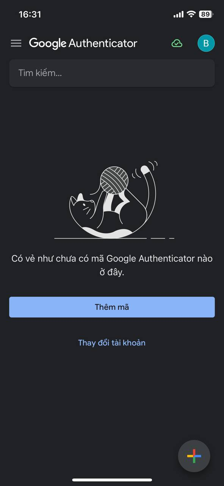

  \

 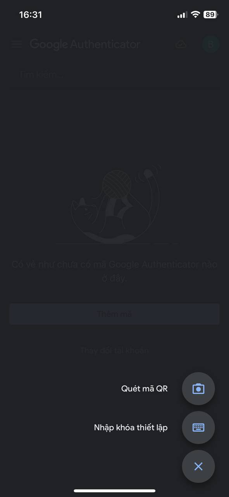


 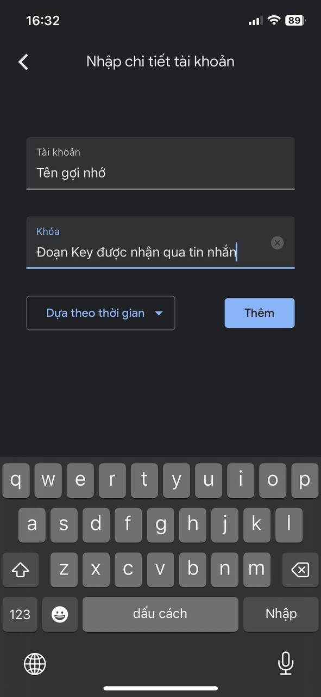


 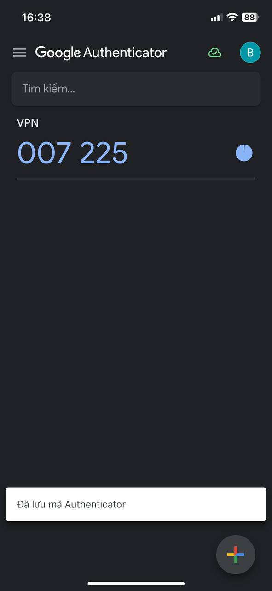


## **II. Download file cài đặt và file config.**

**Bước 1 - Truy cập website: <https://vpn.vccloud.vn/user-site/down> (sử dụng thông tin đăng nhập mà Sysadmin đã cấp).**

**Bước 2 - Chọn Download. Bên dưới sẽ bao gồm 2 bản 1 bản chính (VPN configuaration files) và 1 bản backup (VPN-Backup configuration files) phòng trường hợp bản chính sảy ra sự cố có thể sử dụng bản backup. Tải về bản chính.**


 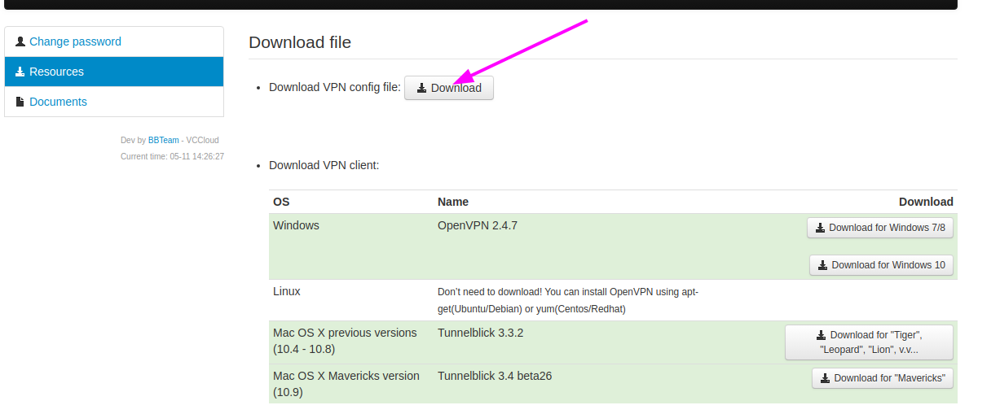


**Bước 3 - Sau khi tải file về tiến hành giải nén ta có file config nằm trong thư mục config.**


**Bước 4 - Tải file cài đặt VPN.**


Chúng ta có 2 lựa chọn cho file cài đặt 


1. **==Option 1: Sử dụng OpenVPN Community==**


Tải file cài đặt tại đây : <https://openvpn.net/community-downloads/>


 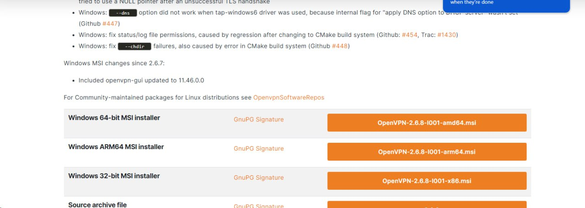


Lựa chọn phiên bản phù hợp với máy tính của bạn.


Sau khi tải về ấn vào file để tiến hành cài đặt.

 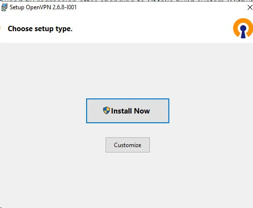


Sau khi cài đặt xong, để có thể kết nối được VPN chúng ta cần copy file config đã tải ở bước 2 vào thư mục OpenVPN (C:\\Program Files\\OpenVPN\\config) như hình dưới đây:


 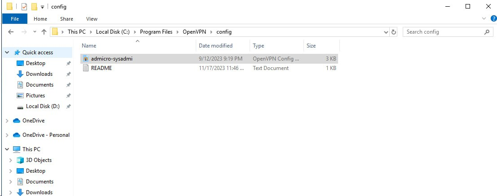


Sau khi thêm file xong click vào biểu tượng máy tính dưới thanh màn hình để tiến hành đăng nhập:


 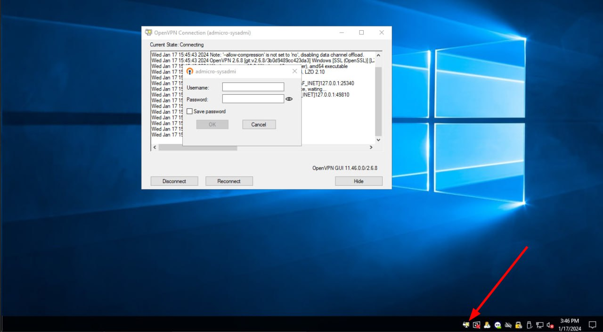


Nhập thông tin tài khoản đã được cung cấp bởi sysadmin:

* username@admicro.vn
* OtpPassword
* Ví dụ: username là (nguyenvana@admicro.vn), OTP lấy từ app google authenticator là (123456) Password là (abcxyz) thì thông tin đăng nhập sẽ là.
* nguyenvana@admicro.vn
* 123456abcxyz


2. **==Option 2: Sử dụng OpenVPN Connect.==**


Tải file cài đặt tại đây : <https://openvpn.net/client/client-connect-vpn-for-windows/>


 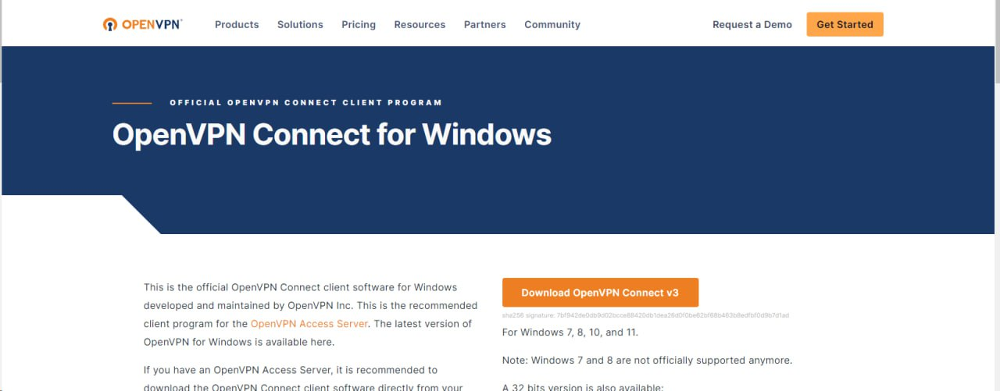


Chọn Download OpenVPN Connect


Sau khi tải về tiến hành cài đặt: 


 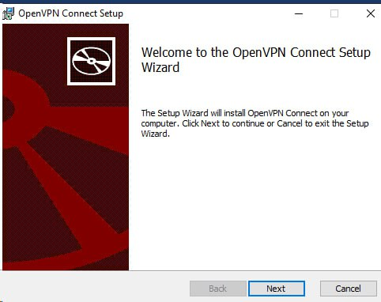


Chọn next.


 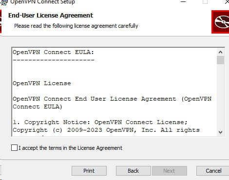


Accept và Next cho tới khi Finish.


 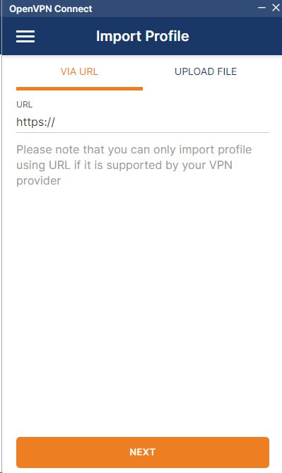


Đây là giao diện của tool.


Chọn UPLOAD FILE > BROWSE sau đó chọn file config đã tải ở bước 2.


Sau khi chọn xong tool sẽ chuyển qua giao diện đăng nhập. Nhập thông tin mà Sysadmin đã cấp:

* username@admicro.vn


* Password nhập theo cú pháp: **otpmậtkhẩu** (OTP và mật khẩu viết liền nhau, OTP lấy từ Google Authenticator)


 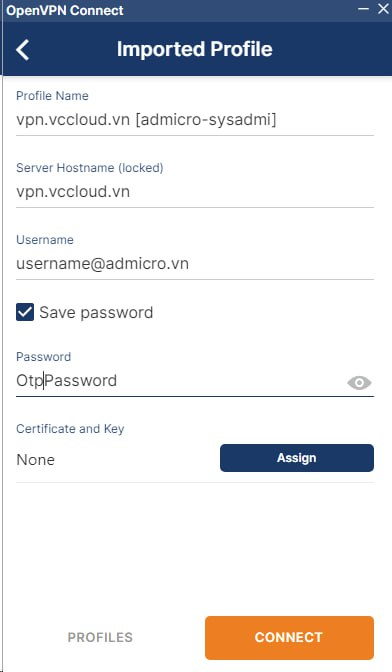


Chọn Don't show again for this profile sau đó click CONTINUE


 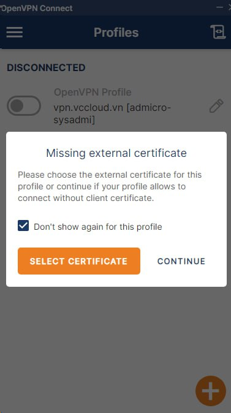


Done bạn đã thành công connect VPN.


\